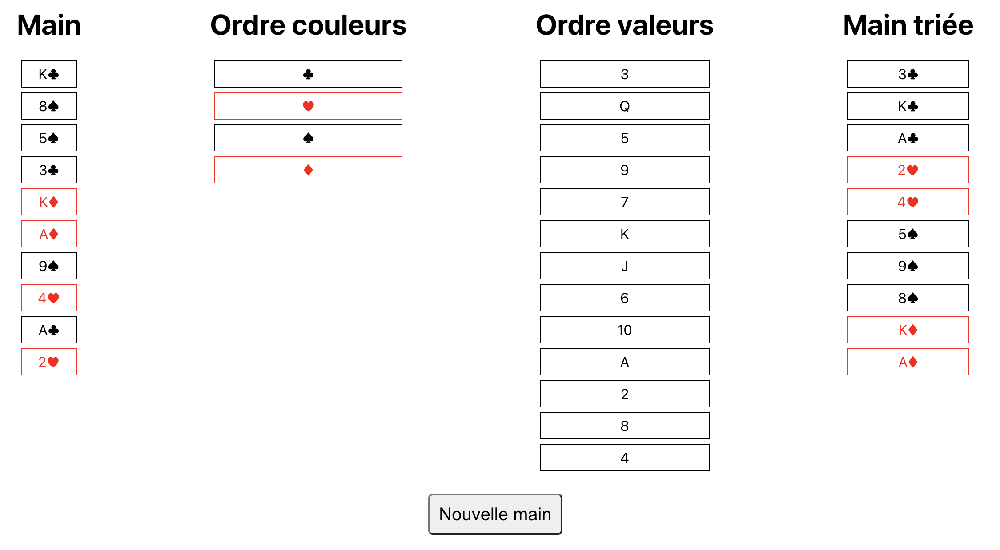

(Technical interview task)

## How to run locally

```bash
docker-compose build && docker-compose up
```

The front end will be available at [http://localhost:3000](http://localhost:3000).
It will be connected to the back end at [http://localhost:8080](http://localhost:8080).


